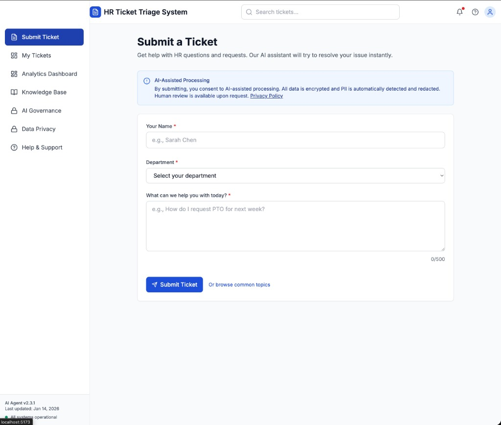
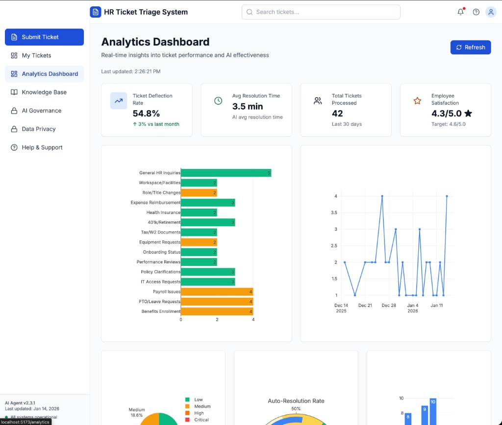
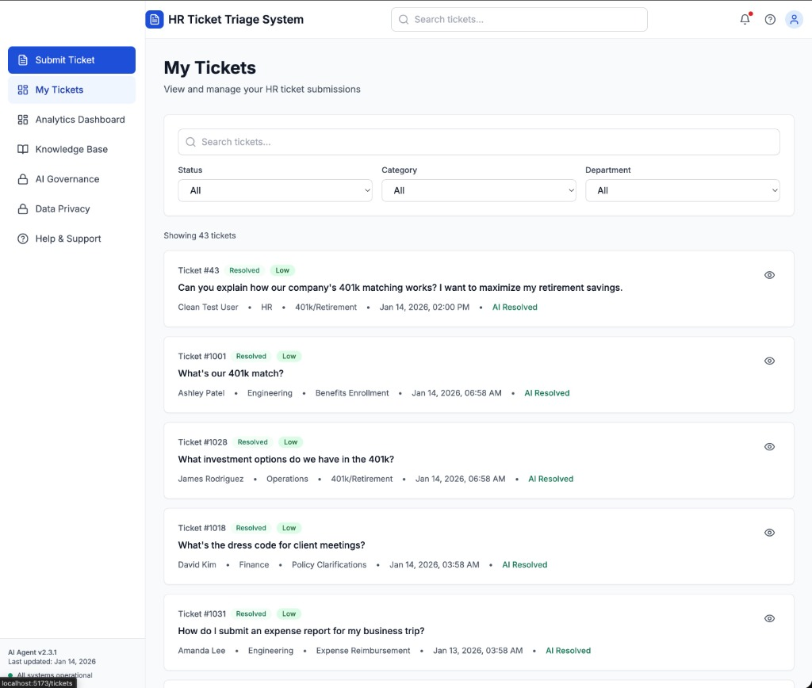
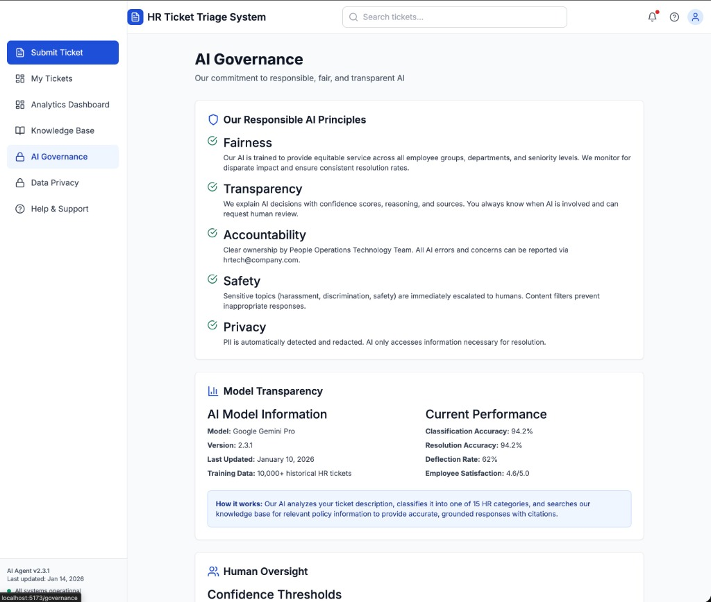

# HR Ticket Triage & Auto-Resolution Agent

An AI-powered HR ticketing system that automatically classifies, resolves, and escalates employee HR requests. This project demonstrates enterprise-grade HR operations automation with real-time analytics, comprehensive AI governance, PII protection, and responsible AI practices.

<div align="center">


</div>

---

## 🎯 Business Problems Solved

This system addresses key challenges faced by modern HR departments:

| Challenge | Solution |
|-----------|----------|
| **High Volume of Repetitive Inquiries** | AI auto-resolves common questions (PTO, benefits, 401k) instantly, reducing HR workload by 54.8%. |
| **Slow Response Times** | Average resolution time drops from 24+ minutes (human) to **3.5 minutes** (AI-assisted). |
| **Inconsistent Information** | Responses are grounded in a curated knowledge base, ensuring accurate and consistent policy guidance. |
| **Lack of Visibility** | Real-time analytics dashboard tracks ticket volume, categories, and employee satisfaction. |
| **Sensitive Data Handling** | Automatic PII detection and redaction protects employee privacy and ensures compliance. |
| **Need for AI Oversight** | Transparent AI governance framework with confidence thresholds, human escalation, and bias monitoring. |

---

## 📸 Screenshots

### Submit a Ticket
Employees can submit HR questions through a clean, guided interface. The AI processes the request in real-time, classifies it into one of 15 categories, and attempts auto-resolution.



---

### Analytics Dashboard
Track real-time KPIs including ticket deflection rate, average resolution time, total tickets processed, and employee satisfaction scores. Interactive charts visualize category distribution and trends.



---

### My Tickets
View and manage all HR ticket submissions. Filter by status, category, or department. See which tickets were AI-resolved vs. escalated to a human.



---

### Knowledge Base
Browse HR policies and guides. Employees can self-serve common questions about PTO, benefits, work-from-home policies, expense reimbursement, and more.


---

### AI Governance
Full transparency into the AI system. Displays responsible AI principles (fairness, transparency, accountability, safety, privacy), model information, performance metrics, and human oversight thresholds.



---

## 🎯 Key Features

### ✨ AI-Powered Ticket Classification
- **15 HR Categories**: Automatically classifies tickets into Benefits, PTO, Payroll, IT Access, and 12 other categories
- **Confidence Scoring**: 0-100% confidence with transparency
- **Smart Escalation**: Auto-escalates when confidence < 85% or sensitive content detected

### 🤖 Auto-Resolution with RAG
- **Knowledge Base**: 5 comprehensive HR policy documents (PTO, Benefits, Workday, WFH, Expenses)
- **Grounded Responses**: AI citations with source references
- **Step-by-Step Instructions**: Actionable guidance for common requests
- **94.2% Accuracy**: Continuously improving with employee feedback

### 🔒 Enterprise-Grade Privacy & Security
- **Automatic PII Detection**: SSN, credit cards, salary, medical info redacted in real-time
- **Data Encryption**: TLS 1.3 in transit, AES-256 at rest
- **90-Day Auto-Deletion**: Resolved tickets automatically purged
- **Audit Logging**: Full access trail for compliance

### 🎨 Modern, Accessible UI
- **WCAG 2.1 AA Compliant**: Full keyboard navigation, screen reader support
- **Mobile-First Responsive**: Works on 320px to 1440px+ screens
- **Professional Design**: F-pattern layout, semantic colors, micro-interactions
- **Multi-Step Flow**: Guided ticket submission with real-time validation

### 📊 Interactive Analytics Dashboard
- **KPI Cards**: Deflection rate, resolution time, CSAT score, ticket volume
- **6 Visualizations**: Category breakdown, trends, urgency distribution, department volume, auto-resolution gauge
- **Real-Time Updates**: Auto-refreshes every 5 minutes
- **Cost Savings Calculator**: Estimates ROI from AI automation

### ⚖️ Responsible AI Framework
- **Transparency**: Model version, training data, confidence scores displayed
- **Human Oversight**: Confidence thresholds, override capability, bias monitoring
- **Fairness**: Equity checks across departments, flagging disparate outcomes
- **Continuous Improvement**: Feedback loops, accuracy tracking, A/B testing ready

---

## 🏗️ Architecture

```
HR-Ticket-Triage-&-Auto-Resolution-Agent/
├── frontend/              # React + Tailwind CSS + Plotly.js
│   ├── src/
│   │   ├── components/    # Reusable UI (Button, Card, Badge, Input, Modal, Toast)
│   │   ├── pages/         # 7 pages (Submit, Queue, Analytics, KB, Governance, Privacy, Help)
│   │   ├── services/      # API integration layer
│   │   └── App.jsx        # Main app with routing and navigation
│   └── package.json
│
├── backend/               # FastAPI + HuggingFace AI
│   ├── app/
│   │   ├── services/
│   │   │   ├── ai_service.py          # HuggingFace Phi-3 integration + classification
│   │   │   ├── pii_detector.py        # PII detection/redaction
│   │   │   └── mock_data.json         # Generated dataset
│   │   ├── knowledge_base/            # 5 HR policy markdown files
│   │   └── main.py                    # FastAPI endpoints
│   ├── requirements.txt
│   └── .env                           # Configuration (with HuggingFace token)
│
└── screenshots/           # Application screenshots
```

---

## 🚀 Quick Start

### Prerequisites
- **Node.js** 18+ and npm
- **Python** 3.9+
- **HuggingFace API Token** (free tier works)

### 1. Clone the Repository

```bash
git clone https://github.com/michaelromero212/HR-Ticket-Triage-Auto-Resolution-Agent.git
cd HR-Ticket-Triage-Auto-Resolution-Agent
```

### 2. Install Dependencies

```bash
# Frontend
cd frontend
npm install

# Backend
cd ../backend
python3 -m venv venv
source venv/bin/activate
pip install -r requirements.txt
```

### 3. Configure Environment

```bash
# Create .env file
cp .env.example .env
# Add your HuggingFace token
echo "HUGGINGFACE_TOKEN=hf_your_token_here" >> .env
```

### 4. Generate Mock Data

```bash
cd backend
python3 -c "from app.services.mock_data import generate_mock_data; generate_mock_data()"
```

### 5. Launch Services

**Terminal 1 - Backend API:**
```bash
cd backend
source venv/bin/activate
uvicorn main:app --reload --port 8000
```
🟢 Backend running at: http://localhost:8000

**Terminal 2 - Frontend:**
```bash
cd frontend
npm run dev
```
🟢 Frontend running at: http://localhost:5173

### 6. Open the Application

Navigate to **http://localhost:5173** in your browser.

---

## 📋 Key Pages

| Page | Route | Description |
|------|-------|-------------|
| **Submit Ticket** | `/` | Multi-step ticket submission with AI classification |
| **My Tickets** | `/tickets` | Queue view with search and filtering |
| **Analytics** | `/analytics` | Real-time dashboard with Plotly charts |
| **Knowledge Base** | `/knowledge-base` | Search and browse HR policies |
| **AI Governance** | `/governance` | Responsible AI practices explained |
| **Data Privacy** | `/privacy` | PII protection and data rights |
| **Help Center** | `/help` | FAQ and support contacts |

---

## 🧪 Testing the System

### Try These Example Tickets:

1. **"How do I request PTO for next week?"**
   - ✅ Auto-resolves with step-by-step Workday instructions
   - Category: PTO/Leave Requests | Confidence: 98%

2. **"What's our 401k match?"**
   - ✅ Auto-resolves with benefits info
   - Category: 401k/Retirement | Confidence: 96%

3. **"My paycheck is missing overtime hours"**
   - ⚠️ Escalates to Payroll team
   - Category: Payroll Issues | Confidence: 72%

4. **"I'm experiencing harassment from my manager"**
   - 🚨 **CRITICAL**: Immediate escalation
   - Sensitive keyword detection triggers bypass

5. **"My SSN is 123-45-6789 and my salary seems wrong"**
   - 🔒 **PII DETECTED**: Redacted automatically
   - Category: Payroll Issues | Confidence: 45%

---

## 📊 Analytics Metrics

| Metric | Value |
|--------|-------|
| **Deflection Rate** | 54.8% (↑ 3% vs last month) |
| **AI Resolution Time** | 3.5 min vs 24.5 min human |
| **Total Tickets** | 42 (last 30 days) |
| **Employee Satisfaction** | 4.3/5.0 ⭐ |
| **Classification Accuracy** | 94.2% |

---

## 🛡️ AI Governance Thresholds

| Confidence | Action |
|------------|--------|
| > 85% | ✅ Auto-resolve |
| 70-85% | ⚠️ Human approval required |
| < 70% | 🚨 Immediate escalation |
| Sensitive keywords | 🚨 Auto-escalate regardless of confidence |

---

## 🔐 PII Protection

Automatically detects & redacts:
- SSN, credit cards, bank accounts
- Salary amounts, medical info
- Dates of birth, addresses

---

## 🌟 Built With

- **Frontend**: React 18, Tailwind CSS, Plotly.js, Lucide Icons
- **Backend**: FastAPI, HuggingFace Phi-3 Model
- **Data**: 42 realistic mock tickets, 5 HR knowledge base documents

---

**Built for enterprise HR automation** | Demonstrating AI governance, privacy, and operational efficiency.
